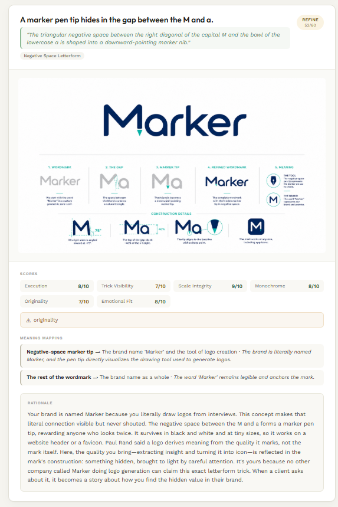
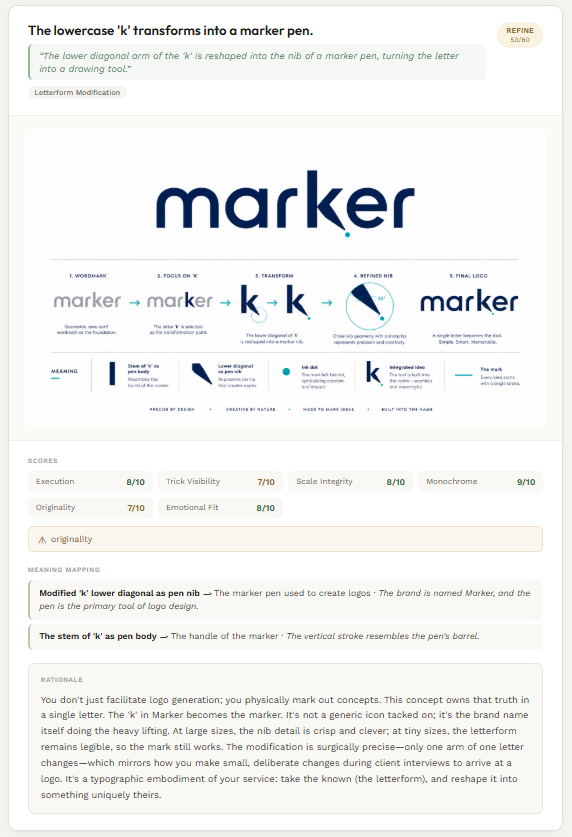
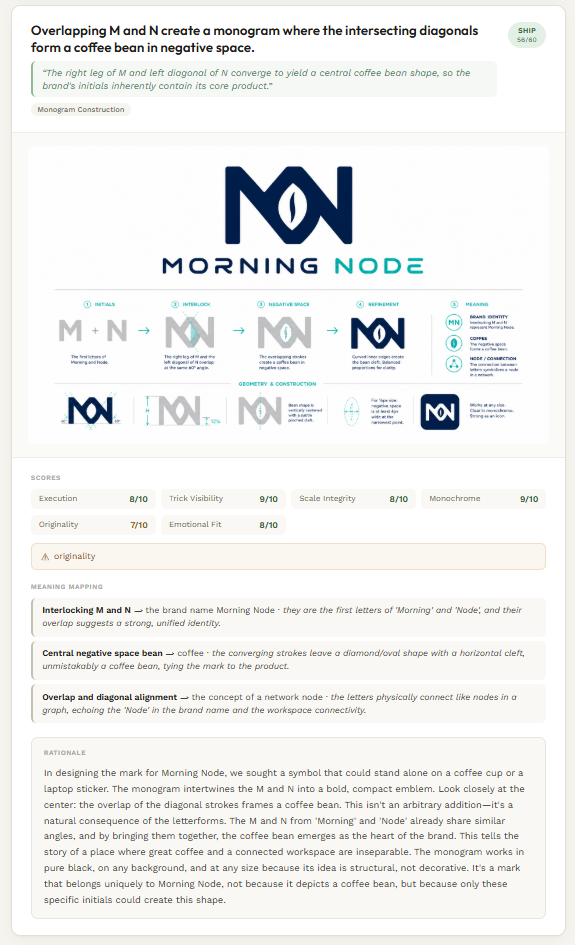
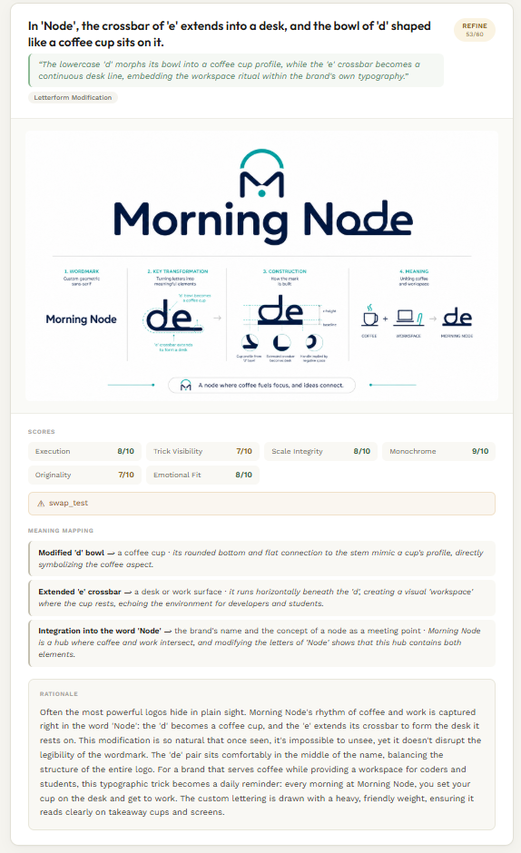
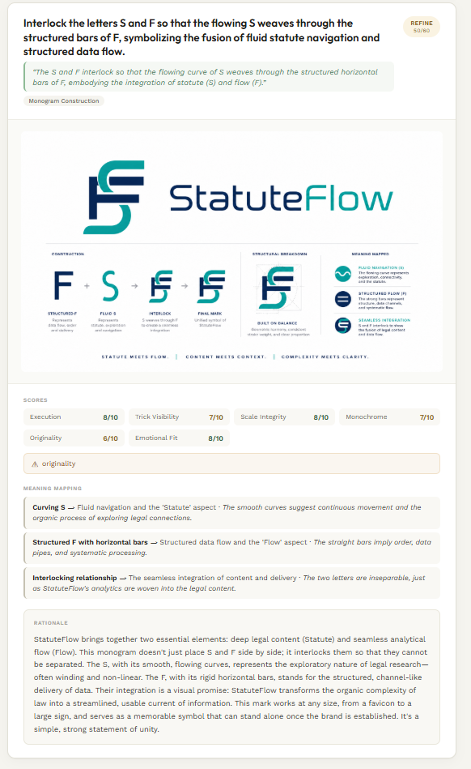

# Marker AI — Conceptual Logo Generation

**Marker AI** is a logo concept generation system that mechanizes the creative interrogation a designer performs on a brand brief. It deconstructs the brand into atomic facts, maps visual opportunities, exhaustively evaluates design techniques, synthesizes concepts, and critiques its own output — producing logo candidates that are genuinely clever, not just stylistically polished.

Unlike template-based logo generators (Looka, Brandmark) that remix icons and typefaces, Marker AI attempts to *find* the logo hidden in the brand's name, story, and meaning — the way Lindon Leader found the arrow in FedEx's E and x, or the way the WWF panda emerged from negative space.

## How It Works

```
User (founder, brief description)
        │
        ▼
┌──────────────────────────┐
│  1. Deconstruction       │  Extract atomic brand facts
│     brand name, verbs,   │  from the brief — what the
│     etymology, audience  │  company DOES, not what it
│                          │  believes.
└──────────────────────────┘
        │
        ▼
┌──────────────────────────┐
│  2. Raw Material         │  Enumerate every visual
│     letter shapes, verb- │  affordance in the letters,
│     to-form, semantics   │  etymology, and meaning.
└──────────────────────────┘
        │
        ▼
┌──────────────────────────┐
│  3. Technique Search     │  Evaluate all 12 design
│     12 techniques scored │  techniques against the
│     against the brand    │  specific raw material.
└──────────────────────────┘
        │
        ▼
┌──────────────────────────┐
│  4. Synthesis            │  Design 3–5 full logo
│     concept specs with   │  concepts, each with
│     meaning mapping      │  construction recipes.
└──────────────────────────┘
        │
        ▼
┌──────────────────────────┐
│  5. Self-Critique        │  Score and filter concepts
│     6-dimension rubric   │  — ship, refine, or reject.
└──────────────────────────┘
        │
        ▼
   Ranked concepts
```

Each concept includes:
- **The Trick** — the one clever, non-obvious observation
- **Meaning Mapping** — every visual element explained: *this shape = that concept, because...*
- **Construction Recipe** — step-by-step instructions executable by an illustrator
- **Rationale Paragraph** — 150–200 words for the founder's brand book
- **Score Breakdown** — cleverness, specificity, monochrome, scalability, originality, emotional fit

## Results

### Marker (the system generating a logo for itself)

**Prompt:** *"Marker is an AI system for generating logo concepts using large language models. The name evokes a marker pen — a tool for making marks, sketching, iterating, and leaving a visible trace of thinking."*




### Morning Node (specialty coffee shop)

**Prompt:** *"We're a coffee shop called Morning Node. The name comes from 'morning' (the time of day when people need coffee most) and 'node' (a connection point, a gathering place). We're the place where morning rituals and community intersect. We roast our own beans and serve single-origin pour-overs."*




### Statute Flow (employment law firm)

**Prompt:** *"Statute Flow is a small employment law firm. We exclusively represent workers — wrongful termination, discrimination, whistleblower retaliation, wage theft. The name combines 'statute' (written law) with 'flow' (the law is not static; it moves, and we move it in our clients' favor)."*



## Architecture

```
marker-ai/
├── Dockerfile                       # Multi-stage build (frontend + backend)
├── docker-compose.yml               # Single-command deployment
├── .dockerignore
├── backend/                        # Python backend
│   ├── pyproject.toml              # uv-managed dependencies
│   ├── src/
│   │   ├── main.py                 # FastAPI entry point
│   │   ├── config.py               # Environment-based configuration
│   │   ├── api/
│   │   │   └── routes.py           # REST endpoints
│   │   ├── models/
│   │   │   └── domain.py           # Pydantic schemas (the data contract)
│   │   ├── llm/
│   │   │   └── deepseek.py         # Async DeepSeek client + LangChain wrapper
│   │   ├── pipeline/
│   │   │   ├── graph.py            # LangGraph StateGraph orchestration
│   │   │   ├── state.py            # Pipeline state dataclass
│   │   │   └── nodes/
│   │   │       ├── deconstruct.py   # Stage 1: Extract atomic brand facts
│   │   │       ├── raw_material.py  # Stage 2: Map visual opportunities
│   │   │       ├── technique_search.py  # Stage 3: Evaluate 12 techniques
│   │   │       ├── synthesize.py    # Stage 4: Design logo concepts
│   │   │       └── critique.py     # Stage 5: Score and filter concepts
│   │   ├── rendering/
│   │   │   └── image_gen.py        # OpenAI GPT Image board generation
│   │   └── storage/
│   └── runs/                       # Pipeline output (gitignored)
│
├── frontend/                       # Next.js 15 + TypeScript frontend
│   ├── package.json
│   ├── next.config.ts
│   ├── tailwind.config.ts
│   └── src/
│       └── app/
│           ├── layout.tsx
│           ├── page.tsx            # Single-page UI
│           └── globals.css
│
├── references/
│   └── techniques.md               # 12-technique taxonomy with case studies
│
├── Marker_Reults_images/           # Output examples for README
│   ├── Marker/
│   ├── Morning_node/
│   └── Statute_Flow/
│
└── .gitignore
```

## Tech Stack

| Layer | Technology | Purpose |
|-------|-----------|---------|
| Reasoning LLM | DeepSeek V4-Pro (concept synthesis + technique search) | High-creativity structured output |
| Fast LLM | DeepSeek V4-Flash (deconstruction + critique) | Low-latency parsing and scoring |
| Image Gen | OpenAI GPT Image 2 | Logo presentation board rendering |
| Pipeline | LangGraph StateGraph | Directed acyclic workflow with shared state |
| LLM Abstraction | LangChain ChatModel wrapper | Standard interface over DeepSeek API |
| Backend | Python 3.11 + FastAPI + uv | Async REST API |
| Frontend | Next.js 15 + TypeScript + Tailwind CSS | SPA with live polling |
| Data Models | Pydantic v2 | Structured outputs with JSON schema |

## Setup

### Docker (recommended)

```bash
# Create your environment file from the template
cp .env.example .env
# Edit .env with your API keys: DEEPSEEK_API_KEY and OPENAI_API_KEY

# Build and start
docker compose up -d
```

The app will be available at http://localhost:8000. API docs at http://localhost:8000/docs.

### Manual Setup

### Prerequisites
- Python 3.11+
- Node.js 20+
- [uv](https://github.com/astral-sh/uv) package manager
- DeepSeek API key
- OpenAI API key (for image generation)

### Environment

```bash
cp .env.example .env
```

Edit `.env`:

```env
DEEPSEEK_API_KEY=sk-...
DEEPSEEK_BASE_URL=https://api.deepseek.com
OPENAI_API_KEY=sk-...
OPENAI_IMAGE_MODEL=gpt-image-2
SKIP_IMAGE_GEN=false
LOG_LEVEL=INFO
```

### Backend

```bash
cd backend
uv sync
uv run uvicorn src.main:app --host 0.0.0.0 --port 8000 --reload
```

API docs at http://localhost:8000/docs

### Frontend

```bash
cd frontend
npm install
npm run dev        # development with API proxy
# or
npm run build      # static export to frontend/out/
```

### Running the Pipeline (CLI)

```bash
cd backend
uv run python -c "
import asyncio
from src.pipeline.graph import build_pipeline_graph
from src.pipeline.state import PipelineState

async def main():
    graph = build_pipeline_graph()
    state = PipelineState(
        run_id='test-1',
        transcript='Brand name: Morning Node\n\nFounder description: A specialty coffee shop...'
    )
    result = await graph.ainvoke(state)
    print('Concepts:', len(result.get('concepts', [])))

asyncio.run(main())
"
```

## Design Principles

1. **Found, not invented.** Great logos are discovered in the brand's existing material — name etymology, letter shapes, founder story, core verbs — not conjured from aesthetic preferences.

2. **Verbs encode; adjectives do not.** "Delivers" encodes as an arrow, a path, a hand extending. "Fast" encodes as nothing. The pipeline treats adjectives as invisible.

3. **The trick is the unit of value.** A logo without a clever observation is a styled wordmark. The concept-generation prompt requires every concept to articulate its "trick" in one sentence.

4. **Exhaust over guess.** Stage 3 evaluates all 12 design techniques against the specific raw material rather than picking the first idea that fits.

5. **Self-critique is mandatory.** Stage 5 scores every concept across 6 dimensions and explicitly rejects weak ones. A system that rates its own output 9/10 is not doing real work.

## The 12-Technique Taxonomy

1. **Negative Space Letterform** — Hidden shape within or between letters (FedEx arrow)
2. **Negative Space Silhouette** — Recognizable object in letter counters or gaps (WWF panda)
3. **Letterform Modification** — Deliberate alteration of a letter (Amazon A→Z smile)
4. **Letterform as Symbol** — A letter becomes the symbol itself
5. **Symbol Fusion** — Two symbols merged into one coherent mark
6. **Geometric Construction** — Mark built from pure geometry, proportions, grids
7. **Gestalt Closure** — Incomplete forms the eye completes (IBM, NBC peacock)
8. **Gestalt Continuity** — Continuous line or path through multiple elements
9. **Numeric/Lexical Embedding** — Numbers or words hidden in the mark (Baskin-Robbins 31)
10. **Cultural/Etymological Mark** — Symbol derived from name's linguistic/cultural origin
11. **Ambigram/Palindrome** — Symmetrical mark that reads the same flipped or reversed
12. **Monogram Construction** — Interlocked or woven initials

## License

MIT
